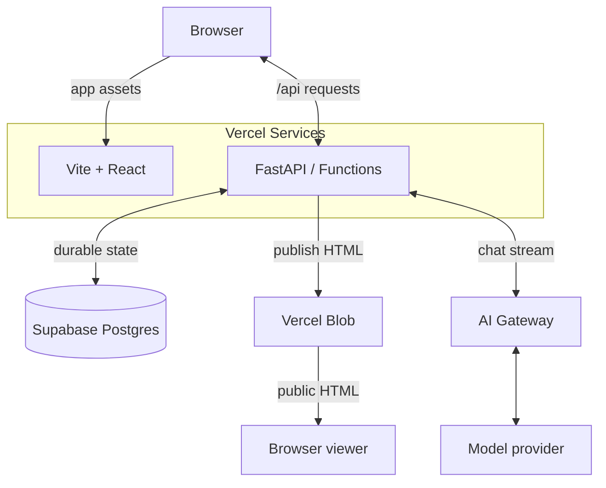
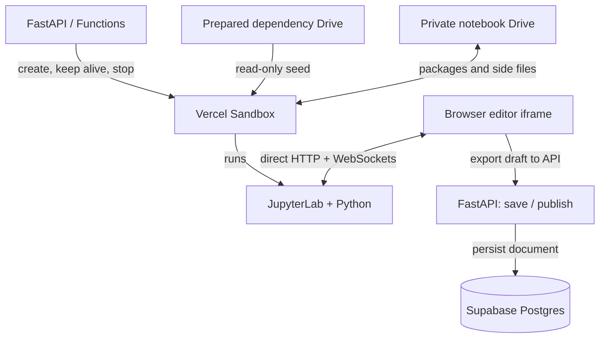

# Notebook Factory

A public Python notebook library with Vercel sign-in, per-user ownership, read-only community browsing, and notebook forks. React and FastAPI run as Vercel Services; temporary JupyterLab environments run in Vercel Sandbox.

## Overall architecture on Vercel

Vercel hosts the web and API services, isolates Python execution in Sandbox, serves published artifacts through Blob, and routes model requests through AI Gateway. Supabase Postgres holds durable application state.

The application and publication path uses two services in one Vercel deployment. API calls share the app origin; published HTML is fetched directly from Blob. Vercel OIDC enrolls users through the API; each notebook has one owner.

Browser and Browser viewer represent the same client, drawn separately to keep the publication path compact. Supabase is connected through Vercel Marketplace. The viewer isolates HTML in a sandboxed iframe; reading a publication never starts a Python kernel.

Notebook execution has a separate lifecycle. The API manages the Sandbox, while the embedded editor connects directly to JupyterLab for HTTP and kernel WebSockets.

The two FastAPI nodes represent the same backend service. The dependency drive contains prepared dependencies, including fonts from Blob, but no private notebook data. The API supplies the current draft and editor assets when creating a session. AI cell tools use the browser bridge to operate on this live editor.

| Platform component | Role in this app | Implementation and details |
| --- | --- | --- |
| Vercel Services and Functions | Deploy frontend and backend together under one origin; FastAPI handles authentication, metadata, persistence, publication, and streamed setup/chat responses. | [vercel.json](../vercel.json), [[backend/main.py]], [[architecture#Services]] |
| Vercel Sandbox | Run notebook Python and JupyterLab in one non-persistent VM per user with separate notebook kernels, a durable writable workspace drive, and a read-only dependency drive. The backend injects the current private draft and fresh editor assets. | [[backend/editor.py#start]], [[editing#Prepared dependency environment]] |
| Vercel Blob | Serve immutable published HTML through the CDN and store the prepared font bundle used to build dependency drives. | [[backend/publication.py#upload]], [[deployment#Published HTML in Blob]], [[editing#Plot font fallback]] |
| Vercel AI Gateway and AI SDK | Route configured model inference and stream assistant responses; browser tools apply cell edits and execution through the authenticated Jupyter bridge. | [[backend/chat.py#stream]], [[frontend/src/Chat.tsx#Chat]], [[chat#Live document tools]] |
| Vercel Queues | Signal sidebar metadata changes to every API instance holding live sidebar WebSockets. | [[backend/workspace_events.py#notify]], [[architecture#Live sidebar updates]] |
| Vercel deployment identity | Supply OIDC for backend Sandbox, Gateway, and Queues access. Blob uses its backend-only read/write token; database and OAuth credentials remain backend configuration. | [[backend/main.py#headers]], [[deployment#Environment configuration]] |
| Supabase via Vercel Marketplace | Persist notebook drafts, published source and fallback HTML, chat history, editor session records, and operation leases across requests and deployments. | [[backend/db.py]], [[architecture#Persistence]], [[chat#Persistent conversations]] |

### Main data flows

Public reading, private editing, and AI assistance share the API and database, while notebook execution and artifact delivery use separate Vercel services.

1. **Read:** the browser loads the React app and public notebook metadata, then fetches published HTML directly from Blob into a sandboxed iframe. The API render endpoint supplies a fallback; public viewing does not start a Sandbox or execute cells.
2. **Edit:** Vercel OIDC establishes the owner session. The API acquires a database lease and opens or reuses a Sandbox. The editor iframe connects directly to JupyterLab, including kernel WebSockets. The browser exports its live document through the bridge and sends autosaved documents to the API for Postgres persistence and automatic publication.
3. **Publish:** autosaves persist the source first, then render and upload only changed documents to Blob. Source, fallback HTML, artifact URL, and revision switch together. Publication does not close the editor or deploy the app.
4. **Assist:** the browser sends an authenticated chat turn to FastAPI, which streams inference through AI Gateway. Notebook tool calls return to the browser and act on the live Jupyter document; rename calls the authenticated API. Read-only community chat history is saved separately in Postgres.

### Deployment and lifetime boundaries

Application deployments, prepared dependencies, live execution sessions, and durable notebook content have independent lifetimes.

[scripts/deploy.sh](../scripts/deploy.sh) prepares immutable font assets and validates or builds the dependency-only drive before deploying both app services. Committed manifests pin these prepared resources; [[deployment#Preparing dependency drives]] describes reuse and rollback requirements.

[[backend/editor.py#generation]] ties editor reuse to the creating deployment so a replacement receives current bridge assets. The shared dependency drive contains no private notebooks or editor tokens. Live Sandboxes are disposable: notebook documents and saved outputs survive in Postgres, while extra installed packages and side files survive on the shared workspace drive. Kernel memory does not persist. See [[editing#Deployment generations]] and [[editing#Closing and recovery]].

Database leases coordinate editor mutations across Function instances. Shutdown and deletion cleanup use response background tasks rather than a durable queue. Public Blob artifacts contain only published content; drafts and editor capabilities stay behind notebook-owner authorization; saved chat is readable publicly. See [[architecture#Authentication]] and [[architecture#Notebook deletion]].

## Product scope

[[frontend/src/main.tsx]] provides notebook navigation, full-text search, creation, public rendering, downloads, and an embedded editor for each notebook owner.

Panel headers use matching uppercase NOTEBOOK and CHAT labels; the notebook heading retains its actual title for assistive technology and hover text. The desktop sidebar is transparent and borderless. A shared 16px gap separates the browser edges, sidebar content, and notebook/chat panels; the logo has a 2px visual inset. The mobile navigation drawer retains an opaque background for readability. The app viewport requests a fixed mobile scale, disabling page zoom where the browser honors viewport restrictions. The selected notebook is reflected in the `notebook` URL query parameter and browser title (`Notebook title — Python Notebooks`), including after renaming. The app uses a triangle favicon; the home and About views have their own titles. Public readers see published content; changed documents are published automatically when autosaved. Creation immediately publishes the starter notebook at revision 1. There is no separate unpublished-notebook state.

Titles are set at creation and can be changed through [[chat#Notebook renaming]]. The owner can delete notebooks through [[architecture#Notebook deletion]]. Notebook upload, revision history, and collaborative editing are not implemented. A revision is a counter, not a stored historical snapshot. [[editing]] describes the editor lifecycle.

## Services

[vercel.json](../vercel.json) routes `/api/:path*` to the FastAPI service rooted at `backend` and `/(.*)` to the Vite service rooted at `frontend`.

The API entrypoint is `main:app`, with a 300-second function limit. The catch-all deliberately uses `/(.*)`: the previous `/:path*` form missed the bare root path in production. Deploy the repository root so both services and rewrites are included.

[frontend/package.json](../frontend/package.json) defines React 19, TypeScript, Vite, and Lucide dependencies. [backend/pyproject.toml](../backend/pyproject.toml) defines FastAPI, SQLAlchemy, Psycopg, nbformat, nbconvert, and the Python Sandbox SDK; the lockfiles resolve installed versions. `backend/.python-version` selects Python 3.13.

Browser API calls stay on the app origin. Editor HTTP and WebSocket traffic connects directly to the Sandbox origin; Functions do not proxy kernel WebSockets. Postgres stores durable notebook state. See [[deployment]] for the actual project configuration.

## Persistence

[[backend/db.py]] owns the notebook table and async SQLAlchemy engine. Postgres is required on Vercel; local development defaults to a SQLite file in the backend directory.

| Fields | Meaning |
| --- | --- |
| `id`, `owner_id`, `title` | UUID identity, owning user slot, and mutable public display title |
| `source` | Latest durable private draft, including saved cell outputs |
| `published` | Notebook document exposed by public render and download endpoints |
| `render_url` | Immutable public Blob URL for rendered HTML; included in notebook metadata |
| `published_html` | Pre-rendered HTML for the same published revision; nullable for legacy rows |
| `created_at`, `updated_at`, `revision` | Creation/publication metadata; draft saves do not change publication time |
| `editor` | Nullable JSON containing shared Sandbox name, unique document path, editor URL, and bridge token |
| `chat_history`, `chat_revision` | Publicly readable conversation with owner-only writes and optimistic concurrency counter |
| `claim`, `claim_until` | Atomic operation lease shared across function instances |

[[backend/db.py#initialize]] creates missing tables under a Postgres transaction advisory lock. It targets a fresh database, with no reserved users or legacy GitHub migrations. Postgres retains up to two idle connections with three overflow connections, pre-ping checks, and five-minute recycling to avoid repeating connection setup on every request. SQLite tests use NullPool. Application shutdown disposes the pool.

[[backend/config.py]] normalizes conventional Postgres URLs for Psycopg and removes Supabase attribution parameters; PostgreSQL TLS options are retained. Deployment startup rejects missing or non-Postgres database configuration.

[[backend/main.py#editor_lease]] serializes create-editor, save, and close operations with a five-minute database lease. Conflicting operations return 409. Lease release matches the claim token, so one request cannot clear another request’s lease.

## Public rendering

[[backend/render.py#render]] converts notebooks to HTML during creation and publication. Public views fetch published HTML from Blob’s CDN into a sandboxed iframe, without executing cells or running nbconvert. [[backend/render.py#validate]] enforces valid notebook structure and the size limit from [[backend/config.py#MAX_BYTES]].

Published iframes stay hidden behind a dark loading surface until their load event, preventing a white flash during navigation.

Published HTML uses the JupyterLab dark palette with shared notebook surface overrides. Read-only spacing is 12px on desktop and 6px at mobile widths, with a compact prompt gutter and no empty Markdown prompt gutter. On mobile, long code snippets and preformatted text scroll horizontally within their own blocks rather than wrapping or widening the page. The shared published-layout stylesheet also applies to previously cached HTML. The browser and fallback endpoint also theme older cached HTML without rerunning cells; existing plot images retain their saved colors.

Lab and base templates are bundled in [backend/templates](https://github.com/vercel-labs/notebook-factory/tree/main/backend/templates), with explicit template search paths. Functions cannot rely on system-installed Jupyter data directories. Public downloads also return `published`, even for the signed-in owner.

The rendered iframe and API response both enforce sandboxing. The CSP blocks network connections and nested frames while permitting selected script CDNs, styles, fonts, and images. Some interactive outputs therefore do not work publicly. HTML conversion runs off the API event loop. Blob upload completes first, then source, fallback HTML, Blob URL, and revision are published in one transaction; rendering failure preserves the prior publication. Legacy rows render once on first read, with a revision-guarded cache write that cannot overwrite a newer publication. Notebook listings select metadata only.

## Authentication

[[backend/auth.py]] uses Vercel OIDC and signed, expiring cookies. [[backend/auth.py#require_user]] admits signed-in Vercel users; [[backend/auth.py#require_owner]] additionally checks notebook ownership on every notebook mutation. Both require an Origin from [[backend/config.py#trusted_origin]]: the canonical APP_URL, plus the deployment and branch URLs on previews.

Sign-in returns to the deployment that started it: [[backend/config.py#served_origin]] picks the allowed origin the request reached, and the signed flow cookie carries that exact redirect_uri into the token exchange. Sign-in requests only openid/profile scopes. The redirect flow omits response_mode to use Vercel’s default query response; explicitly passing query is rejected by the provider. Configuration errors are distinguished from denied consent. Authorization code exchange uses PKCE S256 and a client secret. [[backend/auth.py#verify_identity]] validates RS256 signatures against Vercel’s fixed JWKS endpoint, issuer, audience, expiry, nonce, and authorized party. A signed flow cookie expires after ten minutes; the signed session contains only provider and subject and expires after seven days. Cookies are HttpOnly, SameSite=Lax, and Secure on HTTPS. Provider tokens are never persisted. The verified profile supplies username and avatar, with an initial fallback when no image loads.

Ownership uses the registered user slot bound to a unique Vercel subject ID. Username changes update display identity without changing ownership or the stored Sandbox name. The frontend hides editing controls for other users, while the backend rejects cross-owner calls even with a valid editor token. There is no development authentication bypass.

Public notebook metadata excludes drafts, editor capabilities, and leases. Responses use no-store caching and no-referrer headers. Logout requires an allowed Origin, and the UI disables logout while an editor is open.

## API contracts

[[backend/main.py]] exposes public reads and owner-only mutations. [[backend/auth.py]] provides identity, OAuth login/callback, and logout routes.

| Route | Contract |
| --- | --- |
| `GET /api/notebooks` | Public metadata including owner ID, ordered by publication update time |
| `GET /api/workspace` | Public users and minimal notebook metadata for the sidebar |
| `WS /api/workspace/live` | Same-origin socket; pushes the workspace snapshot on connect and after each change |
| `GET /api/users` | Alphabetical public user IDs, usernames, and avatars |
| `POST /api/notebooks/{id}/fork` | Enrolled caller copies published notebook content into a new owned notebook, without chat or editor state |
| `POST /api/notebooks/{id}/chat-history` | Public read-only history, optionally the latest 50 messages |
| `PUT /api/notebooks/{id}/chat-history` | Owner-only revision-checked conversation save |
| `POST /api/notebooks` | Enrolled user creates a starter notebook from a nonblank title, returning 201 |
| `GET /api/notebooks/{id}/render` | Published HTML with isolation headers |
| `GET /api/notebooks/{id}/download` | Published `.ipynb` attachment |
| `POST /api/notebooks/{id}/editor` | Owner opens/reuses an editor; JSON or event stream depending on Accept |
| `POST /api/notebooks/{id}/save` | Validates session token, persists draft, optionally publishes |
| `POST /api/notebooks/{id}/close` | Persists draft, detaches editor, schedules notebook kernel shutdown |
| `POST /api/notebooks/{id}/rename` | Owner with current editor token updates the public workspace title |
| `POST /api/notebooks/{id}/delete` | Owner permanently removes notebook, draft, and chat history; schedules Sandbox and Blob cleanup |
| `POST /api/notebooks/{id}/discard` | Discards draft, restores published source, and schedules shutdown |
| `GET /api/auth/me` | Identity, edit permission, and OAuth configuration status |
| `GET /api/health` | Process liveness only; does not query Postgres or Sandbox |

Save and close require the current editor capability token in the JSON body. Stale tokens return 409; expired/unavailable editors can return 410; oversized or invalid notebook documents return 413 or 422. Setup errors after streaming begins arrive as events, not a changed HTTP status.

## Editing

[[editing]] documents provisioning, the save bridge, progress events, and temporary-environment behavior. [[backend/editor.py]] is the Python SDK boundary; [[frontend/src/main.tsx]] coordinates the browser lifecycle.

## Authorization tests

[[backend/tests/test_app.py]] checks anonymous, non-owner, and cross-origin mutations, forged cookies, OAuth state rejection, and anonymous access to the setup stream.

## Persistence tests

[[backend/tests/test_app.py]] checks private/public separation, editor reuse, stale sessions, failure recovery, concurrent startup, and save-before-shutdown behavior.

It also checks bundled rendering templates, workspace-relative launcher paths, progress events, and lease release after startup failure. [[verification]] describes how to run the suite and what requires live infrastructure.

## Viewport layout

[Frontend styles](../frontend/src/style.css) fixes the app to the dynamic viewport height and suppresses outer document scrolling and overscroll. The notebook surface fills the remaining space; its compact panel header contains the title and notebook actions.

The app uses Geist typography, black and neutral dark surfaces, high-contrast actions, semantic status colors, and 2px control/panel corners. Avatars and status dots remain circular.

Notebook and chat panels use the available workspace width with a fixed 12px outer inset and 12px gap between panels at every breakpoint. They share compact, aligned headers; chat actions are grouped at the right. Errors appear below the workspace with matching horizontal margins. Title spacing is compact.

The sidebar aligns its brand with the panel titles, followed by search, the outlined “How it’s built” link, the high-contrast New notebook button, with 30px separating the search/button group from the brand and notebook list. These three controls share a 40px height; primary actions use a subdued light-gray fill. Controls omit shortcut hints. Clicking anywhere in the search field focuses its input. Focus highlights the whole search container with a neutral border rather than outlining the nested input. The notebook list hides its scrollbar track while remaining scrollable, so user-row hover backgrounds share the exact left and right edges of the sidebar controls. User rows have 8px internal horizontal padding so hover backgrounds frame the avatar, name, and count. Notebook indentation preserves a shared avatar/icon centerline. Escape dismisses the new-notebook dialog.

The sidebar brand is a Vercel triangle with “Python Notebooks”; clicking it returns to the unselected notebook state. The browser title uses the same name. The project repository is linked from the About page. The breadcrumb toolbar and separate large notebook heading are omitted. Download, delete, chat, fork, and edit controls live in the notebook panel header. The Chat button appears only when the chat panel is closed; the panel’s close button handles dismissal. On mobile, an outlined Menu button precedes the title inside the notebook panel header, avoiding a separate navigation row. The welcome screen retains its own Menu button.

Published and editor iframes scroll internally rather than imposing minimum heights on the page. The sidebar notebook list scrolls independently with overscroll disabled; sidebar branding and account controls stay fixed. Setup output has a bounded scroll area. Compact spacing preserves notebook space on short landscape screens.

## Workspace startup

The public sidebar renders independently of authentication and updates live over a WebSocket. A five-minute, tab-local metadata cache lets return visits show the sidebar immediately while fresh metadata loads.

[[frontend/src/main.tsx#cachedNotebooks]] stores only the public list and published render URLs in session storage. Auth and edit permissions are never cached. Fresh list responses replace cached entries and reconcile selection; unavailable storage falls back to normal loading.

Opening the app without a notebook query parameter shows a welcome prompt to choose from the sidebar, never selecting the first cached or fetched notebook automatically. Direct notebook links still open their target; missing targets return to the welcome view. The logo returns to this unselected view while preserving mounted editors. Switching notebooks shows the destination publication unless it already has a connected editor in this browser; a green sidebar dot identifies those live editors. Returning reuses the same iframe and kernel. On mobile, Browse notebooks opens navigation. An empty workspace retains its creation prompt. [[backend/db.py]] closes app-side connections after each database operation and delegates pooling to Supabase transaction mode.

## Notebook deletion

The owner sees a red outlined trash button in the notebook header. Confirmation names the notebook and explains that its published document, draft, and chat history will be deleted.

[[backend/main.py#delete_notebook]] requires owner authentication and exact Origin, acquires the editor lease, and removes the database row. The UI returns to the unselected view and removes cached sidebar metadata. Background tasks stop the notebook kernel, remove its directory (or record deferred deletion if the shared VM is offline), clean up its legacy private drive, and remove all published Blob artifacts under that notebook's prefix through [[backend/publication.py#remove]]. Cleanup failures are logged; the database deletion remains effective, but this is not a durable cleanup queue and cached public copies may persist.

## Notebook deletion tests

Owner deletion removes public reads and sidebar metadata, schedules Sandbox and artifact cleanup, and returns not found for repeated deletion. Mutation authorization coverage rejects anonymous users, other users, and cross-origin requests.

## User enrollment and capacity

[[backend/accounts.py#enroll]] admits at most 300 users, while the users table independently enforces an absolute 500-row ceiling. Existing registered users can sign in at capacity.

Postgres enrollment uses a transaction advisory lock around identity lookup, capacity check, and slot allocation. The table has a unique primary-key slot constrained to 1–500, making a 501st row impossible even for direct SQL inserts. Vercel subject IDs and display logins are unique. Username collisions receive a deterministic subject-derived suffix and never claim another account.

[[backend/db.py#initialize]] creates an empty schema. User Sandbox names are generated from the enrollment username and an app/slot hash, then stored immutably so username changes do not create a second runtime.

## Community navigation and forks

[[backend/main.py#workspace]] returns users and minimal notebook metadata in one users-to-notebooks outer join, retaining empty user groups and omitting source, HTML, chat, and editor data.

The browser loads this endpoint at startup, then receives the same payload live; see [[architecture#Live sidebar updates]]. Group expansion and running editors remain unchanged.

The sidebar expands the current user's avatar/name group first, followed by other users alphabetically and collapsed by default. Search expands matching groups; notebook selection retains background editors and agent sessions.

Other users' notebooks and saved conversations are read-only, including for anonymous visitors. Only the owner can start an editor, send chat messages, clear history, rename, save, or delete. [[backend/main.py#fork_notebook]] copies published cells, metadata, and outputs into a new notebook owned by the caller. The new title is prefixed with “fork of ”. It renders a separate Blob artifact and initializes empty chat/history and no editing session. Unsaved/private drafts are not copied.

## Multi-user isolation tests

[[backend/tests/test_accounts.py]] covers concurrent enrollment at capacity, hard database limits, stable Vercel identity, username collisions, and empty initial databases. API tests deny every cross-owner mutation and verify forks never copy chat, editor tokens, or private drafts.

Runtime tests prove two notebooks owned by one user share a VM while a second user gets another VM. Browser checks verify default group expansion and ordering for both the original account and a different logged-in user, read-only chat/controls, and fork ownership with an empty conversation.

## Vercel sign-in tests

[[backend/tests/test_auth.py]] checks PKCE exchange and signed sessions, rejects invalid signature/issuer/audience/nonce/expiry, rejects old GitHub cookies, and proves failed state or denied consent never exchanges a code.

### Preview deployments sign in on their own origin

A request forwarded for an allowed preview host gets that host's callback as redirect_uri in both authorize and token exchange, and returns to `/`. Unknown hosts fall back to APP_URL; mutations accept preview origins only.

## Sidebar refresh tests

The workspace endpoint uses one metadata-only outer join, includes users without notebooks, and returns no document or editor data. Browser checks verify sidebar refresh preserves navigation and editor state.

## Live sidebar updates

Sidebar changes reach open browsers within about a second: writers publish a queue signal, and each API instance pushes a fresh workspace snapshot to its sockets.

[[backend/workspace_events.py#notify]] runs after create, fork, render-URL backfill, changed publication saves, rename, delete, and enrollment that adds a user or changes a login or avatar. It sends a payload-free message to a per-environment topic with 60-second retention, sent to all deployments in one fixed region. Publish failures are logged and never fail the committed write.

[[backend/workspace_events.py#serve]] accepts same-origin sockets at `/api/workspace/live` and sends a snapshot immediately. Because the socket is public and cookie-free, [[backend/main.py#same_origin]] accepts an Origin equal to APP_URL or to the request's forwarded host, so preview, branch, and custom-domain deployments work; authenticated mutations still require the exact APP_URL. While an instance has sockets, [[backend/workspace_events.py#_relay_loop]] polls the topic with its own process-unique consumer group, so every instance sees every signal; push consumers cannot reach sockets on other instances. Any batch is acknowledged and answered with one [[backend/workspace_events.py#snapshot]] read sent to all local sockets; a lock keeps snapshots ordered. Duplicates or replays only cause a redundant snapshot. Without queue configuration (local development and tests) changes broadcast in-process.

The WebSocket handler installs request headers so OIDC resolves for the relay. The browser applies each snapshot like an HTTP refresh, reconnects with exponential backoff up to 30 seconds (sockets close at the function duration limit), and falls back to the 30-second HTTP refresh only while disconnected.

## Live sidebar tests

Socket tests verify origin handling, a connect snapshot equal to the HTTP endpoint, pushes after rename, create, and delete, end-to-end delivery through the embedded queue server, and that queue publish failures never fail writes.

Origin coverage rejects cross-origin sockets, including a forwarded host that does not match the Origin, and accepts preview-host and request-host origins.

## Notebook search

[[backend/search.py]] searches public notebook titles and published code/Markdown cell sources with PostgreSQL full-text search. A stored weighted vector and GIN index keep document parsing out of the request path.

Titles have higher weight than cell text. Quoted phrases, OR, and minus exclusions use websearch_to_tsquery with English stemming. Results contain only notebook metadata, ranked and limited to 100. Drafts, outputs, and chat are excluded. Database-generated vectors update with publication or rename; startup adds the vector and index to existing tables. SQLite development uses title substring matching only.

The browser debounces searches for 250 milliseconds, cancels stale requests, shows loading/failure/empty states, and leaves the selected notebook and active editors intact. Clearing search restores the live full sidebar.

## About page

The public `/about` route provides a compact technical overview, with component responsibilities and links to source code and architecture documentation.

[[frontend/src/About.tsx#About]] covers Vercel Services connecting the backend and frontend in one project, Vercel CDN, Python hosting with FastAPI, Supabase, Blob, AI Gateway, Python AI SDK, AI SDK UI, Sandbox and its Python SDK, Jupyter, Vite, and lat.md (the final entry). The sidebar exposes the page, and the Vite build emits an About app shell for direct `/about` requests. In-app navigation retains mounted editors and background chat work, while browser history supports leaving and returning to the page. The layout uses simple typography and a responsive definition list in its own scroll area. Supabase appears first, Vite and CDN share one entry with separate links. Every technology in the left column links to its documentation; Python AI SDK points to ai-python.dev, its AI SDK UI compatibility is explicit, and the Sandbox description links to the Python SDK reference. Vercel products and SDKs use triangle branding, and GitHub source and “See lat.md project architecture” buttons precede the list. The docs button opens [[deployment#Static project documentation|the static Lat UI]] at `/lat/`.
